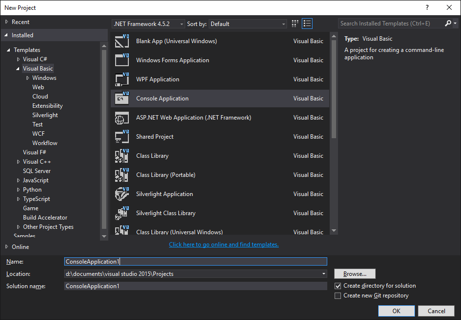

= 
:icons: font
:experimental:

Now you will create your first VB.NET program.

== Creating a new project

This book assumes that you are using Visual Studio 2015 Community.
The user interface may be a bit different in other versions of Visual Studio.
However, these small differences should not make other versions unusable.

//image::images/vs2015.png[Visual Studio 2015 Community, title="Visual Studio 2015 Community"]

After you start Visual Studio, select “New Project” in the File menu.
Select “Visual Basic” in the left pane, and then “Console Application” in the right pane.
Give the project a name (if not “ConsoleApplication1”), and then press “Okay”.
A project with a file called `module1.vb` will be created.

<<<
== Unable to install Visual Studio?

You can make simple programs in Visual Basic.NET online in link:http://www.tutorialspoint.com/compile_vb.net_online.php[TutorialsPoint CodingGround].

NOTE: When you are using online platforms, there is generally no need to add `Console.ReadLine()` at the end of the program.

== Adding some code
Now you should add your own code between `Sub Main()` and `End Sub`.
Your file should look like this:

[include, lang-vb](code/hello_world.vb)

== Running the program

Press the key kbd:[F5] to run the program.
The output should look like this:
[role="sample-output", subs="normal"]
....
Hello world!
....

After seeing the result, press the key kbd:[Enter] to close the program.

<<<
== Using the code view
For those familiar with word processors, the code editor should be very easy to use.
However, this is not the case for an average student.
So it will be advantageous to try the following:

* _Remember the shortcut key kbd:[Ctrl+Z] for undo.
  This is the FIRST thing to do when something is wrong._

* Use the keys kbd:[Insert], kbd:[Delete], kbd:[Backspace] and kbd:[Enter].
  Do this
** at the beginning of a line, and
** in the middle of a line.

* Select text by holding kbd:[Shift] while using the arrow keys.

* Use the shortcut keys kbd:[Ctrl+C] (copy), kbd:[Ctrl+X] (cut) and kbd:[Ctrl+V] (paste).

* Type when there is an active selection.
  See how the text is overwritten.

* Advanced: While holding kbd:[Ctrl], press the left and right arrow keys to move the cursor.
  You may use this in combination with the kbd:[Shift] key.
