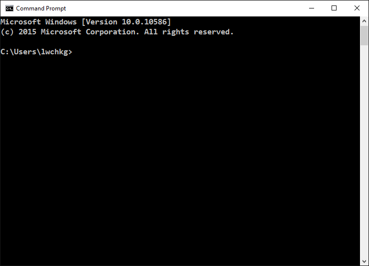

= 

*Console applications* are programs that are used via a text only interface.
The most popular console application is perhaps the “Command Prompt” in Microsoft Windows.
It can be opened by finding “Command Prompt” in the Start Menu, or by running the “*cmd*” command.

== Comparison with GUI applications

Most computer users use only *GUI (graphical user interface) applications*, with graphical elements like buttons, text boxes, pull-down menus, etc.
While GUI applications are more satisfying to users, they are not easy to create.
Instead, creating console applications is straight forward even for beginners.

Therefore, you are learning to create console applications first.
When you acquire enough experience, you can learn to create GUI applications.
