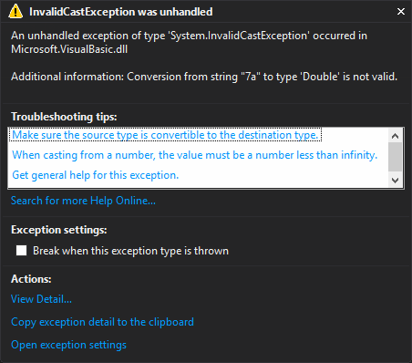

= 
:icons: font

You have learnt about the `Console` object, variables, and doing calculations in Visual Basic.
Now you can write simple programs by using them together.
See the example below:

[include, lang-vb](code/area_of_triangle.vb)

Here is how the program runs:

[role="sample-output", subs="normal"]
....
Enter the base of the triangle: [userinput]#5#
Enter the height of the triangle: [userinput]#7#
The area of the triangle is 17.5.
....

There are a few main points:

* To show a message (prompt) before input, use `Console.Write` before `Console.ReadLine`.
* Output with one or more `Console.WriteLine` statements.
* If a statement is too long, you may break it into several lines to make it easier to read.

== What if I do not enter a number?

If you do not enter a number in the input, e.g. `7a`, the program will end up in a runtime error like this:

The error happens because Visual Basic is unable to convert “`7a`” into a number.
A good programmer should deal with these cases with additional code.

We are now not good enough to write these code properly.
But we can suppress the error using the `Val` function, which does always succeed.
All we need to do is like the example below:

[source, vb]
Dim base As Double = Val(Console.ReadLine())

NOTE: Using `Val` to suppress warning has many undesired effects.
      You should used other ways to do the conversion after you learn them.
