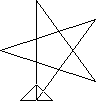

= 
:icons: font

Here are the names and characteristics of some programming languages.

NOTE: You are only required to remember the names of these programming languages.
      (The characteristics and example are provided for reference only.)

== BASIC

BASIC (Beginner’s All-purpose Symbolic Instruction Code) is designed to be easy-to-learn.
It gradually evolved into modern programming languages, firstly QuickBasic, and then Visual Basic.

[options="header", cols="2a,1l"]
|===
|Example program |Output
|[source]
....
10 FOR I=1 TO 5
20 PRINT I*I
30 NEXT I
....
|1
4
9
16
25
|===

== Logo

Logo is known for drawing attractive graphics. It was used to teach
programming in schools.

[options="header", cols="2a,1l"]
|===
|Example program |Output
|[source]
....
REPEAT 5 [FD 100 RT 144]
....

(Note: `FD` = forward, `RT` = right turn. +
Only the star is drawn. The triangle is the cursor, pointing upwards.)
|
|===

<<<
== Pascal

Pascal was designed mainly to teach good programming style.
Pascal is being taught in the HKDSE ICT syllabus.
Some modern programs are also written in Pascal.

[options="header", cols="2a,1l"]
|===
|Example program |Output
|[source]
....
program example1;
var i : integer;
begin
  for i := 1 to 5 do
  begin
    WriteLn(i*i);
  end;
end.
....
|
1
4
9
16
25
|===

== C++

+++C++ is one of the most popular programming language (much more popular
that Pascal). If you want to be a good programmer, C++ is a programming
language that you must learn.+++

+++C language, the predecessor of C++, is also widely used today.+++

[options="header", cols="2a,1l"]
|===
|Example program |Output
|[source]
....
#include <iostream>
int main(int argc,char* argv[])
{
  for (int i=1; i<=5; i++) {
    cout << i*i << endl;
  }
}
....
|
1
4
9
16
25
|===

<<<
== Java

Java is one of the most popular programming languages, mostly used in client-server or web applications.
Java is also the programming language for Android apps.

[options="header", cols="2a,1l"]
|===
|Example program |Output
|[source]
....
public class HelloWorld {
  public static void main(String []args) {
    for (int i=1; i<=5; i++) {
      System.out.println(i*i);
    }
  }
}
....
|
1
4
9
16
25
|===

== JavaScript

JavaScript is available in a web browser, allowing dynamic user interaction in a web site.
New web technologies, i.e. Ajax and HTML5 rely on JavaScript as the programming language.

There is also a framework called node.js that allows JavaScript code to be run outside browsers.

== PHP

PHP is one of the most popular programming languages for a web server.
With PHP you can dynamically generate web contents, and many other things, depending on user input.
PHP is used in http://www.tanghin.edu.hk.

== Visual Basic.NET

Visual Basic.NET is the programming language you are going to learn in this book.
Visual Basic is the easiest programming language to learn if you want to create a program in Graphical User Interface (GUI).
