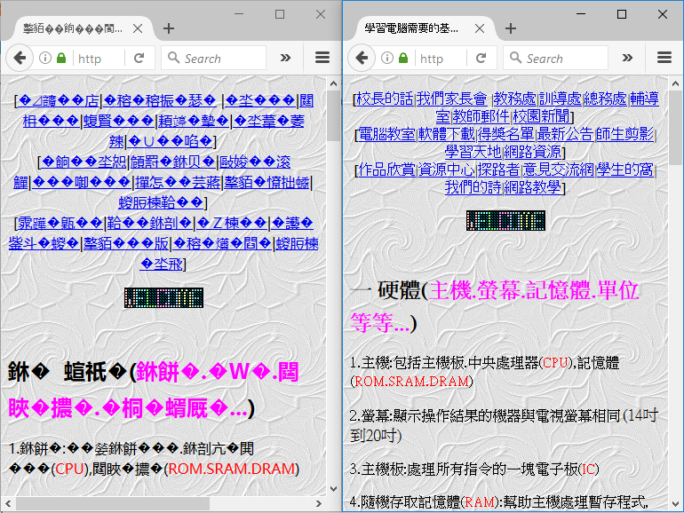

= 
:icons: font

In this chapter, we learn about strings and text manipulation in VB.NET.

== Strings and characters

Text is stored in computer programs in the form of *strings*.

A string is a sequence of *characters*.
There are different types of characters, such as letters, digits, punctuation marks, symbols, white spaces, and *control characters*.

== How is text stored in computers?

Unlike humans, computers do not recognise text by its image or sound.
Instead, text is converted into numbers, and computers store the numbers instead.
A scheme that maps characters into numbers is called a *character set*.

We also have a concept of *character encoding*, which tells how text in a particular character set is stored in memory.
The concept of character encoding is particularly important for Unicode, which has different character encodings for the same character set.
For other character sets, we can simply use these two terms interchangeably.
A few common character sets are introduced below:

=== ASCII

*ASCII*, the American Standard Code for Information Interchange, is an old character set which is still significant nowadays.
ASCII is still significant because most character sets (including Big5, GBK, and Unicode) are backwards compatible with ASCII.
We use the term compatible because these character sets contain an exact copy of the US-ASCII character set.

ASCII consists of 128 characters, and each character is assigned a *code point*.
However, only code points 32 to 126 are “printable”, i.e. used for text.
The rest of the characters are called *control characters*.

<<<

Here is the list of ASCII printable characters.
You are supposed to remember the code point of letters and digits, but not the special symbols.

[cols="^h,^l,^l,^l,^l,^l,^l",options="header"]
.ASCII table (printable characters only)
|==========================
|  |32 |48 |64 |80 |96 |112
|+0 |(sp) |0 |@ |P |` |p
|+1 |! |1 |A |Q |a |q
|+2 |" |2 |B |R |b |r
|+3 |# |3 |C |S |c |s
|+4 |$ |4 |D |T |d |t
|+5 |% |5 |E |U |e |u
|+6 |& |6 |F |V |f |v
|+7 |' |7 |G |W |g |w
|+8 |( |8 |H |X |h |x
|+9 |) |9 |I |Y |i |y
|+10 |* |: |J |Z |j |z
|+11 |+ |; |K |[ |k |{
|+12 |, |< |L |\ |l |\|
|+13 |- |= |M |] |m |}
|+14 |. |> |N |^ |n |~
|+15 |/ |? |O |_ |o |
|==========================

For the control characters, only CR (13) and LF (10) are significant in VB.NET.
In Windows, the character sequence CR + LF moves the cursor to the next line.
In VB.NET, this sequence can be referred as the constant `vbCrLf`.

<<<

=== Big5 and GBK

In the past, different character sets were used to store text in different languages.
We used Big5 for traditional Chinese and GBK for simplified Chinese.

Unfortunately, with the exception of ASCII, we cannot mix text with different character sets together.
Worse still, text at those times was often communicated without specifying a character set, or even specifying a wrong character set.
When this happened, the text cannot be read unless the actual character set is selected.

If a wrong character set is used to read text, the text appears garbled.
See the figure below for an example of selecting a wrong character set.
This continues to happen for some web sites today, like the one in the figure.

<<<
=== Unicode

Finally, Unicode is made to encode text in different languages simultaneously with a single system.
There are three mainstream character encodings in Unicode, namely UTF-8, UTF-16, and UTF-32.
Here is a comparison of the character encodings:

[cols="^,^,^",options="header"]
|===
|Character encoding |Size of code unit (bytes) |Size of a character (bytes)
|ASCII |1 |1
|Big5 |1 |1 or 2
|GBK |1 |1 or 2
|UTF-8 |1 |1, 2, 3 or 4
|UTF-16|2 |2 or 4
|UTF-32|4 |4
|===

== Strings in .NET platform

Strings in .NET platform are encoded in UTF-16.
In UTF-16, characters with Unicode code point 65535 or below are encoded with one code unit (2 bytes), and others are encoded with two code units (4 bytes).

If a character is encoded in two code units, then it behaves like two separate characters in VB.NET.
In these cases, string functions related to characters, the length of string and position of characters do not work properly.
Unfortunately, these special characters include Chinese names and Emojis, which are quite commonly used.

See http://www.unicode.org/charts/PDF/U20000.pdf to see a list of Chinese characters and http://unicode.org/emoji/charts/full-emoji-list.html for the list of Emojis.

If your application handles text in other languages, then the situation is even more complex because of combining diacritical marks.
The concepts involved are too advanced to discuss here.

// Uncomment the following lines if fonts are missing.
[.phantom]
icon:tags[] a _a_ `a` $$\left( \frac{a}{1^2} \right)$$

[.phantom.sans]
123
